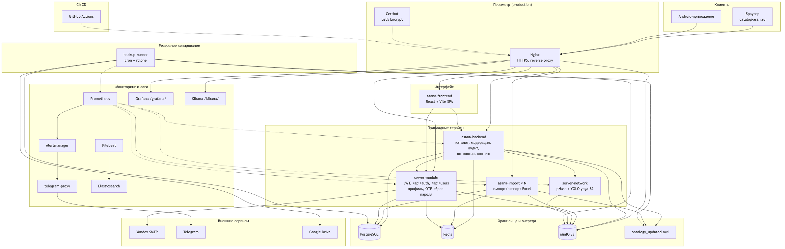

# asana-services

Монорепозиторий платформы «Каталог асан традиционных школ йоги».

Проект собирает в одном месте:
- каталог асан (frontend + backend API);
- отдельный сервис тяжелого импорта/экспорта;
- сервис авторизации и пользовательских функций;
- сервис ИИ-обработки изображений;
- инфраструктуру для локального и production-запуска.

**Production:** `https://catalog-asan.ru`  
**Домен с www:** `https://www.catalog-asan.ru`

---

## Содержание

- [1. Описание проекта](#1-описание-проекта)
- [2. Что умеет система](#2-что-умеет-система)
- [3. Для кого этот проект](#3-для-кого-этот-проект)
- [4. Архитектура](#4-архитектура)
- [5. Структура репозитория](#5-структура-репозитория)
- [6. Технологический стек](#6-технологический-стек)
- [7. Быстрый старт (локально)](#7-быстрый-старт-локально)
- [8. Конфигурация через .env](#8-конфигурация-через-env)
- [9. Маршрутизация и API](#9-маршрутизация-и-api)
- [10. Production и деплой](#10-production-и-деплой)
- [11. Масштабирование импорта](#11-масштабирование-импорта)
- [12. Диагностика и эксплуатация](#12-диагностика-и-эксплуатация)
- [13. Безопасность перед публикацией репозитория](#13-безопасность-перед-публикацией-репозитория)
- [14. Contributing](#14-contributing)

---

## 1. Описание проекта

`asana-services` — это серверная и клиентская платформа для ведения каталога асан с привязкой к источникам, фотографиям и экспертной модерацией.

Проект решает практическую задачу: хранить и обновлять большой каталог асан в одном месте, с прозрачной ролью каждого пользователя и управляемым процессом импорта данных.

Ключевые особенности реализации:
- выделенный контур тяжелого импорта и экспорта (`asana-import` + Redis);
- отдельный контур auth и пользователей (`server-module`, SMTP, OTP-сброс пароля);
- хранение изображений в S3-совместимом хранилище (MinIO);
- ИИ-сервис для поиска совпадений и модерации связей `isSameAs`;
- мониторинг, логи, алерты в Telegram и ежедневные бэкапы в Google Drive.

---

## 2. Что умеет система

- каталог асан с источниками, названиями и изображениями;
- роли доступа (гость, эксперт, администратор);
- создание пользователей администратором (самостоятельная регистрация отключена);
- профиль пользователя: смена пароля и аватара;
- восстановление пароля по **6-значному OTP-коду** на email;
- импорт и экспорт данных (длинные операции через отдельный сервис);
- модерация записей и подтверждение изменений;
- ИИ-модерация связей `isSameAs` (pHash + YOLO);
- аудит действий пользователей (админ-панель);
- мониторинг (Prometheus, Grafana, Kibana) и алерты в Telegram;
- ежедневные бэкапы PostgreSQL, OWL и S3 → Google Drive;
- работа через единый веб-интерфейс (React SPA) с API за reverse proxy.

---

## 3. Для кого этот проект

- для команд, которые ведут предметный каталог и регулярно обновляют данные;
- для экспертных групп, где важны роли и модерация изменений;
- для проектов, где нужно отделить длинные импортные задачи от интерактивного API.

---

## 4. Архитектура

Платформа разделена на независимые контейнеры за единым **Nginx**. Тяжёлый импорт, авторизация, ИИ-обработка, мониторинг и бэкапы вынесены в отдельные сервисы, чтобы не блокировать интерактивный API каталога.

### Диаграмма

<div align="center">



</div>

<p align="center"><sub>Клиенты → Nginx → прикладные сервисы → PostgreSQL / Redis / MinIO · мониторинг · бэкапы · SMTP / Telegram / Google Drive</sub></p>

### Маршрутизация Nginx

| Путь | Сервис | Назначение |
|------|--------|------------|
| `/` | `asana-frontend` | React SPA |
| `/api/auth*`, `/api/users*` | `server-module` | вход, профиль, OTP-сброс, пользователи |
| `/api/import*`, `/api/export*`, онтология upload/download | `asana-import` | длинный импорт/экспорт |
| `/api/*` | `asana-backend` | каталог, модерация, аудит, контент |
| `/images/*` | `minio` | фото асан и аватары |
| `/grafana/`, `/kibana/` | Grafana, Kibana | только админ (cookie через `/api/auth/monitoring-session`) |

### Потоки данных

1. **Каталог** — frontend → `asana-backend` → PostgreSQL / OWL / MinIO; JWT проверяется через `server-module`.
2. **Импорт Excel** — frontend → `asana-import` → Redis (статусы, lock OWL) → PostgreSQL / OWL / MinIO; масштабируется `--scale asana-import=N`.
3. **ИИ-модерация** — `asana-backend` → `server-network` → предложения `isSameAs` в очередь эксперта.
4. **Почта** — `server-module` → Yandex SMTP (создание пользователя, OTP-код восстановления пароля).
5. **Мониторинг** — Prometheus собирает метрики сервисов и exporters; Alertmanager → `telegram-proxy` → Telegram.
6. **Логи** — Filebeat → Elasticsearch → Kibana.
7. **Бэкапы** — `backup-runner` по cron: дамп PostgreSQL + OWL + префиксы S3 → архив → Google Drive (rclone); метрики в Prometheus.

### CI/CD

GitHub Actions (`.github/workflows/deploy-dict-service.yml`) собирает образы, пушит в registry и перезапускает стек на сервере `/app`. После деплоя в Alertmanager уходит алерт `DeployCompleted`.

---

## 5. Структура репозитория

```text
asana-services/
├── asana-dict-service/
│   ├── backend/                # API каталога (FastAPI)
│   ├── import-service/         # воркер импорта/экспорта
│   ├── frontend/               # SPA (React/Vite)
│   └── ИНСТРУКЦИЯ_ДЛЯ_ЭКСПЕРТОВ.md
├── asana-server-module/        # auth + user API + SMTP
├── asana-network-service/      # ИИ-сервис обработки изображений
├── backup-runner/              # cron-бэкапы БД/OWL/S3 → Google Drive
├── monitoring/                 # Prometheus, Grafana, Alertmanager, exporters
├── architecture_diagram.png    # диаграмма архитектуры (README)
├── docker-compose.yml          # локальный/dev стек
├── docker-compose.prod.yml     # production стек
├── nginx.conf                  # nginx для локального запуска
└── nginx.prod.conf             # nginx для production (HTTPS)
```

---

## 6. Технологический стек

- Backend/API: Python, FastAPI
- Frontend: React, Vite
- База данных: PostgreSQL
- Координация задач: Redis
- Объектное хранилище: MinIO (S3 API)
- Reverse proxy: Nginx (+ Certbot в production)
- Мониторинг: Prometheus, Grafana, Alertmanager, exporters
- Логи: Filebeat, Elasticsearch, Kibana
- Бэкапы: backup-runner, rclone → Google Drive
- CI/CD: GitHub Actions
- Контейнеризация: Docker, Docker Compose

---

## 7. Быстрый старт (локально)

### Требования

- Docker + Docker Compose
- свободные порты: `80`, `3000`, `5432`, `8000`, `8001`, `8002`, `9000`, `9001`

### Шаги

1) Перейдите в корень проекта:

```bash
cd asana-services
```

2) Подготовьте `.env` в корне (см. раздел ниже).

3) Поднимите стек:

```bash
docker compose up -d --build
```

4) Проверьте доступ:

- сайт: `http://localhost`
- frontend напрямую: `http://localhost:3000`
- API через nginx: `http://localhost/api/...`
- MinIO console: `http://localhost:9001`

5) Посмотрите статус:

```bash
docker compose ps
```

---

## 8. Конфигурация через .env

Compose подхватывает переменные из корневого `.env`.

Минимальный набор, который должен быть заполнен осмысленно:

- база: `DB_HOST`, `DB_PORT`, `DB_NAME`, `DB_USER`, `DB_PASSWORD`;
- auth: `SECRET_KEY`, `ALGORITHM`, `ACCESS_TOKEN_EXPIRE_MINUTES`;
- почта (Яндекс): `SMTP_HOST`, `SMTP_PORT`, `SMTP_USER`, `SMTP_PASSWORD`, `SMTP_FROM`;
- сброс пароля: `PASSWORD_RESET_OTP_TTL_MINUTES` (по умолчанию 15);
- minio: `MINIO_ROOT_USER`, `MINIO_ROOT_PASSWORD`, `NAME_BUCKET_IMAGES_MINIO`;
- интеграции: `AUTH_SERVICE_URL`, `NETWORK_SERVICE_URL`;
- мониторинг: `GRAFANA_ROOT_URL`, `KIBANA_ROOT_URL` (логин Grafana = `ADMIN_USERNAME` / `ADMIN_PASSWORD`);
- алерты Telegram: `TELEGRAM_BOT_TOKEN`, `TELEGRAM_CHAT_ID` (опционально `TELEGRAM_HTTP_PROXY`, `VLESS_URI` для telegram-proxy);
- активность пользователей: `REDIS_URL`, `USER_ONLINE_WINDOW_SECONDS` (по умолчанию 300);
- бэкапы: `BACKUP_CRON`, `RUN_BACKUP_ON_START`, `BACKUP_MIN_INTERVAL_SECONDS`, `GDRIVE_REMOTE`, `RCLONE_CONFIG_BASE64`.

Важно:
- `.env` не должен попадать в git;
- для production используйте отдельный `/app/.env` на сервере;
- для публичного репозитория храните только безопасный `.env.example`.

---

## 9. Маршрутизация и API

Маршруты настраиваются в `nginx.conf` и `nginx.prod.conf`.

Основные правила:

- `/api/auth*`, `/api/users/me*` и часть endpoint'ов `/api/*` -> `server-module`;
- `/api/import/*`, `/api/export/*`, `/api/upload-ontology`, `/api/download-ontology` -> `asana-import`;
- остальные `/api/*` -> `asana-backend`;
- `/images/*` -> `minio`;
- `/` -> `asana-frontend`.

Это разделение позволяет обслуживать длинные импортные запросы отдельно от пользовательских API.

---

## 10. Production и деплой

Production-конфигурация: `docker-compose.prod.yml`.

Типовой сценарий на сервере:

1. Подготовить каталог `/app` и положить туда рабочий `.env`.
2. Скопировать:
   - `docker-compose.prod.yml` как `/app/docker-compose.yml`;
   - `nginx.prod.conf` как `/app/nginx.prod.conf`.
3. Запустить:

```bash
cd /app
sudo docker-compose pull
sudo docker-compose down
sudo docker-compose up -d --scale asana-import=3
```

В проекте есть GitHub Actions workflow для сборки и деплоя:
- `.github/workflows/deploy-dict-service.yml`.

Он обновляет версию образов и перезапускает стек на сервере.

### Яндекс.Вебмастер и SEO

После деплоя на `https://catalog-asan.ru`:

1. **Подтверждение прав** — файл `frontend/public/yandex_5ef638559f7ee62a.html` (метод «HTML-файл»).
2. **Главное зеркало** — указать `https://catalog-asan.ru` (без `www`, если не используется).
3. **robots.txt** — `https://catalog-asan.ru/robots.txt` (статика из `frontend/public/robots.txt`).
4. **Sitemap** — добавить в Вебмастере URL `https://catalog-asan.ru/sitemap.xml` (генерируется backend из OWL-каталога: асаны, источники, публичные страницы).
5. **Переобход** — после крупных обновлений каталога можно запросить переиндексацию ключевых страниц в Вебмастере.

Переменная `PUBLIC_SITE_URL` (или `SITE_URL`) в `.env` backend задаёт базовый URL в sitemap и canonical на фронте (`VITE_PUBLIC_SITE_URL` при сборке frontend).

---

## 11. Масштабирование импорта

`asana-import` можно масштабировать отдельно:

```bash
docker compose up -d --scale asana-import=3
```

Почему это работает:
- импорт вынесен в отдельный сервис;
- статусы и координация задач идут через `redis`;
- nginx отправляет `/api/import/*` в импортный сервис.

---

## 12. Диагностика и эксплуатация

Полезные команды:

```bash
# поднять стек
docker compose up -d

# список контейнеров
docker compose ps

# логи backend
docker compose logs -f asana-backend

# логи import-сервиса
docker compose logs -f asana-import

# перезапустить сервис
docker compose restart asana-import

# выполнить команду в контейнере
docker compose exec asana-backend sh

# остановить и удалить контейнеры сети
docker compose down
```

Если "зависает" импорт:
- проверьте `asana-import` и `redis`;
- проверьте nginx route `/api/import/status/...`;
- проверьте таймауты клиента и proxy.

### Мониторинг и логи (только администратор)

- **Grafana** (`/grafana/`) — метрики и дашборды (Application, Catalog, AI, Infrastructure, Backup).
- **Kibana** (`/kibana/`) — логи контейнеров (Data View `asana-logs-*`, раздел Discover).
- **Swagger** (`/api/docs`) — документация API.

Доступ закрыт на уровне nginx: без cookie администратора откроется 403.  
В админ-панели Grafana/Kibana открываются во встроенном окне: cookie выдаёт `GET /api/auth/monitoring-bootstrap` (маршрут nginx → `asana-backend`, не `server-module`).

Прямые порты Prometheus/Elasticsearch/Kibana/Grafana наружу не публикуются — только через nginx.

### Алерты в Telegram

В `.env` на сервере:

```env
TELEGRAM_BOT_TOKEN=123456:ABC-DEF...
TELEGRAM_CHAT_ID=123456789
```

Как получить `TELEGRAM_CHAT_ID`: напишите боту `/start`, затем откройте  
`https://api.telegram.org/bot<TOKEN>/getUpdates` и возьмите `chat.id`.

После изменения `.env`:

```bash
docker compose up -d alertmanager prometheus
```

Alertmanager шлёт уведомления (правила в `monitoring/prometheus/alerts.yml`):

| Алерт | Условие |
|-------|---------|
| **ServiceDown** | Сервис не отдаёт метрики **5+ минут** |
| **CoreApiDown** | `asana-backend` или `server-module` недоступен **3+ мин** |
| **Http5xxBurst** | **>10** ответов 5xx за **10 минут** (по сервису) |
| **Http5xxBurstGlobal** | **>25** ошибок 5xx за 10 мин по всем API |
| **HighHttp5xxRate** | >10% запросов — 5xx в течение 10 мин |
| **HighHttp4xxRate** | >25% запросов — 4xx (15 мин) |
| **HighLatencyP95** | P95 ответа API >5 с (10 мин) |
| **ImportServiceHighLatency** | P95 импорта >30 с (15 мин) |
| **BackupFailed / BackupStale / BackupGDriveFailed** | ошибка, нет бэкапа >26 ч, не загрузился в Drive |
| **HighMemoryUsage / HighDiskUsage / HighCpuLoad** | RAM >90%, диск >85%, CPU >90% |
| **AiServiceDown / AiHttp5xxBurst** | ИИ-сервис недоступен 5 мин или >5 ошибок 5xx за 10 мин |

Без `TELEGRAM_BOT_TOKEN` и `TELEGRAM_CHAT_ID` Alertmanager стартует, но уведомления не отправляет.

После деплоя CI шлёт **один алерт** `DeployCompleted` в Alertmanager (`POST /api/v2/alerts`) — в Telegram уходит то же сообщение, что и для остальных алертов (нужны `TELEGRAM_*` в `.env`).

### Почта (Яндекс)

В `/app/.env`:

```env
SMTP_HOST=smtp.yandex.ru
SMTP_PORT=465
SMTP_USER=noreply@yandex.ru
SMTP_PASSWORD=пароль_приложения
SMTP_FROM=noreply@yandex.ru
```

- **SMTP_PASSWORD** — [пароль приложения](https://id.yandex.ru/security/app-passwords) (не основной пароль от почты).
- В настройках почты Яндекса включите **«С сервера imap.yandex.ru» / доступ по SMTP**.

Порт **465** — SSL. Для **587** в коде автоматически используется STARTTLS.

```bash
docker compose up -d server-module asana-backend
```

### Ежедневные бэкапы

Сервис `backup-runner` по cron (по умолчанию **03:00 UTC**) создаёт архив:

- дамп PostgreSQL;
- файл онтологии OWL;
- префиксы S3 (`asans`, `avatars`).

Архив загружается в **Google Drive** через `rclone`. На сервере в `/app/.env`:

```env
BACKUP_CRON=0 3 * * *
RUN_BACKUP_ON_START=false
BACKUP_MIN_INTERVAL_SECONDS=82800
BACKUP_KEEP_LOCAL_ARCHIVES=1
GDRIVE_REMOTE=gdrive:asana-backups
RCLONE_CONFIG_BASE64=...   # base64 конфига rclone с OAuth к Google Drive
```

- **`RUN_BACKUP_ON_START=false`** — не запускать бэкап при каждом рестарте контейнера.
- **`BACKUP_MIN_INTERVAL_SECONDS=82800`** (~23 ч) — защита от частых повторных запусков.
- Локально хранится один последний архив; в Drive — файл `asana-backup-latest.tar.gz` (перезапись).

Статус бэкапов — метрики в Prometheus и дашборд **Backup Status** в Grafana. Алерты: `BackupFailed`, `BackupStale`, `BackupGDriveFailed`.

Ручной запуск на сервере:

```bash
docker compose exec backup-runner BACKUP_FORCE=1 /app/run-backup.sh
```

Конфиг rclone на сервере: `./backup-runner/rclone/` (или через `RCLONE_CONFIG_BASE64`).

### Инструкция для экспертов

- В репозитории: `asana-dict-service/ИНСТРУКЦИЯ_ДЛЯ_ЭКСПЕРТОВ.md`
- В UI: раздел **«Инструкции»** (редактируется администратором)
- При первом старте backend подхватывает markdown из volume `seed_content`

---

## 13. Безопасность перед публикацией репозитория

Перед тем как делать репозиторий публичным, обязательно:

1. Убедиться, что `.env` и любые приватные ключи не попадут в git.
2. Удалить из истории случайно закоммиченные секреты (если были).
3. Ротировать секреты после любого инцидента:
   - `SMTP_PASSWORD`;
   - `SECRET_KEY`;
   - пароли БД/MinIO;
   - токены CI/CD.
4. Оставить в репо только шаблонные значения (`.env.example`).

---

## 14. Contributing

Если хочешь предложить улучшение:

1. Создай issue с описанием проблемы или идеи.
2. Сделай отдельную ветку под изменение.
3. Оформи PR с коротким описанием:
   - что изменено;
   - зачем изменено;
   - как проверено.
4. Для изменений в инфраструктуре приложи команды запуска/миграции.

При работе с кодом не коммить:
- `.env`;
- приватные ключи;
- дампы БД и локальные конфиги.

---

## Смежные README

- `asana-dict-service/README.md`
- `asana-dict-service/ИНСТРУКЦИЯ_ДЛЯ_ЭКСПЕРТОВ.md`
- `asana-dict-service/frontend/README.md`
- `asana-front-module/README.md`
- `android-dict-app/README.md`
- `monitoring/alertmanager/README.md`

